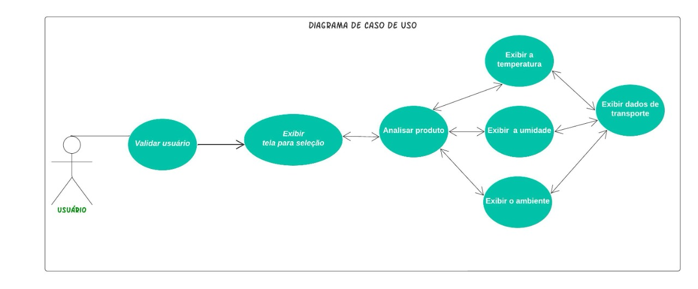
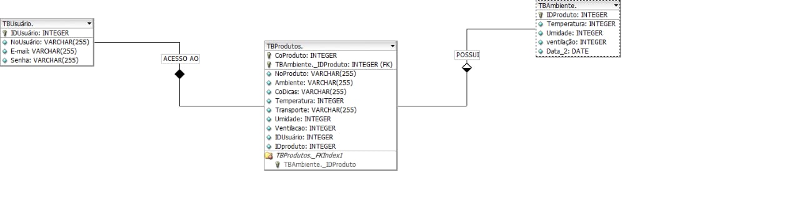

## Seminário de Orientação do Projeto Integrador
CURSO: TECNOLOGIA EM SISTEMAS PARA INTERNET

TEMA: SISTEMA DE GERENCIAMENTO PARA FRUTAS E VERDURAS - DIAGRAMAS

GRUPO: 
 FERNANDA BEATRIZ TAVARES GOMES

 POLIANA DE ARAUJO PEREIRA

 JONATHAN LEONCIO DE SOUZA LIRA
 
ORIENTADOR:

COORIENTADOR: GLENDA

 
 ## Ideia do Projeto

Esse projeto tem o objetivo de realizar analise de dados das frutas e hortaliças, para reduzir o desgaste desses alimentos. Através de um dispositivo para controle dos dados referentes a temperatura, umidade e fluxo de ventilação do ar, como também dados sobre ambiente adequado, transporte e dicas para melhor conservação, essas informações serão apresentadas para os usuários através da exibição no aplicativo.
 
 ## Diagrama de Caso de Uso
 
Esse diagrama é responsável por descrever o ponto de vista do usuário do sistema, descrevendo funcionalidades e acessos para cada tipo de usuário. Não é preciso descrever detalhes técnicos, como por exemplo como o sistema será implementado ou o que será feita, mas apenas o que será possui realizar nesse software quando ele estiver implementado. O Diagrama de Caso de Uso é composto por os tipos de usuários (Cliente, Administrador, etc), cenário que é o fluxo/eventos que o usuário poderá acessar, Use Case são as tarefas e funções que o usuário poderá executar e a comunicação das tarefas com os usuários.

 

Esse diagrama apresenta o fluxo do usuário para acesso ao aplicativo do projeto, o primeiro seria o de login que avançará diretamente para tela de login quando já possui usuário cadastrado, e outro fluxo para cadastrar o usuário, que passará inicialmente pela tela de cadastro para poder ter acesso as demais funcionalidades do software. Posteriamente, esse usuário chegará até o menu da fruta ou hortaliça, para escolher o produto que irá analisar, ao realizar a escolha irá para o menu de dados, para escolher entre: dados da temperatura, umidade e ventilação do ar, exibindo o dado coletado através do dispositivo e também a recomendação adequada para aquele produto. Também terá opções no menu referente a condições do ambiente, condições do transporte e dicas de conservação da fruta/hortaliça escolhida. 

A criação do diagrama de caso de uso neste projeto tem o intuito de demonstrar como o sistema vai apresentar o seu comportamento, definir a estrutura e o comportamento entre os elementos de modelo. Através dele percebemos sua utilidade e contribuição para criação do modelo da criação de banco de dados. Durante a criação percebemos que tivemos que fazer algumas alterações para que o formato fosse resumido, durante a criação houve alterações na  diminuição da quantidade de atores e no resumo do cenário.
 ## Diagrama de Modelagem do Banco de Dados 
Esse diagrama é responsável por estruturar dados do banco do projeto, incluindo sua estrutura lógica, relações e restrições, capazes de determinar como esses dados serão armazenados e manipulados. Há vários tipos de diagrama nesse contexto: Modelo de banco de dados hierárquico, Modelo relacional, Modelo de rede, Modelo de banco de dados orientado para objetos, Modelo entidade-relacionamento, Modelo documental, Modelo entidade-atributo-valor, Esquema em estrela e outros. Optamos por realizar o diagrama do projeto no Modelo Entidade Relacionamento, em que é baseado no mundo real, as entidades são objetos, que possuem seus atributos e se relacionam entre si.

 

Esse diagrama representa a modelagem do banco de dados que será utilizado para o desenvolvimento do projeto, possuindo duas tabelas de armazenamento de dados. Uma para usuários, com seu nome, email e senha, para realizar cadastro e login no sistema. E outra para os dados dos produtos (frutas e hortaliças), com seu nome, dicas para sua conservação, dados referente a melhor temperatura, umidade e ventilação, como também transporte e ambiente adequado. E essas duas tabelas se relacionam de muitos para muitos, onde muitos usuários podem ter muitas frutas ou hortaliças e muitos produtos podem ter vários usuários.

## Referências
Site DevMedia. acesso em:https://www.devmedia.com.br/o-que-e-uml-e-diagramas-de-caso-de-uso-introducao-pratica-a-uml/23408

Site DevMedia. acesso em: https://www.devmedia.com.br/modelagem-1-n-ou-n-n/38894

Site SAP. acesso em: https://www.sap.com/brazil/insights/what-is-data-modeling.html

Site Escola superior de redes. acesso em: https://esr.rnp.br/desenvolvimento-de-sistemas/open-5/#:~:text=Modelagem%20de%20banco%20de%20dados%20%C3%A9%20o%20processo%20de%20levantamento,que%20ir%C3%A3o%20sustentar%20uma%20aplica%C3%A7%C3%A3o.

Site LucidChart. acesso em: https://lucid.app/lucidchart/e1c7a36c-240e-4049-bfb2-650aff28889d/edit?beaconFlowId=0ECE9BEA7E0EE31F&page=HWEp-vi-RSFO&invitationId=inv_6b4c67f4-854b-4c64-adc9-eef34f715ad5#

Diagramas de Caso de Uso, Copyright IBM Corporation, acesso em: https://www.ibm.com/docs/pt-br/rsm/7.5.0?topic=diagrams-use-case

Entendendo o Diagrama de Sequência da UML. Ventura, Plínio. acesso em: https://www.ateomomento.com.br/diagrama-de-sequencia-uml/
